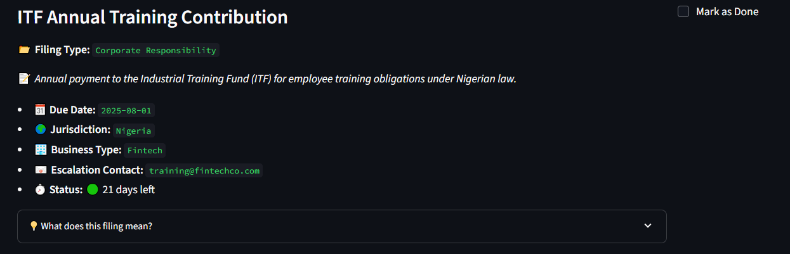

# 📅 Smart Compliance Filing Tracker

A workflow automation tool that helps financial service companies **track legal, regulatory, and tax obligations** — with **GPT-powered explanations**, **Slack deadline alerts**, and a **streamlit UI** for real-time visibility.




---

## 🚀 Features

✅ Visual filing tracker (built in Streamlit)  
✅ Filing urgency status (Overdue / Due Today / etc.)  
✅ Daily automated checks for upcoming deadlines  
✅ Slack alerts for due/overdue filings  
✅ GPT-powered filing explainer  
✅ Export to CSV  
✅ Easily extendable for email alerts, multi-user workflows, or database support

---

## 🏗️ Project Structure
<pre lang="markdown">
compliance-tracker/
│
├── app/ # Streamlit UI
│ └── main.py
│
├── workflows/ # Automation logic
│ └── scheduler.py
│
├── notifications/ # Slack integration
│ └── slack_bot.py
│
├── data/
│ └── filing_schedule.json # Filing records (editable)
│
├── run_daily.py # Runs daily checks at 09:00 AM
├── requirements.txt
├── .env # Slack webhook (not committed)
├── README.md
└── .gitignore
</pre>

---

## 📦 Installation

### 1. Clone this repo

```bash
git clone https://github.com/your-username/compliance-tracker.git
cd compliance-tracker
```

### 2. Create virtual environment & install requirements
```
python -m venv venv
venv\Scripts\activate   # on Windows
# OR
source venv/bin/activate   # on Mac/Linux

pip install -r requirements.txt
```
### 3. Create .env for Slack alerts

Create a .env file in the root folder:
<pre> ```ini
SLACK_WEBHOOK_URL=https://hooks.slack.com/services/your/webhook/url
</pre> 

### 💻 Usage

▶️ Launch the Streamlit App
```
streamlit run app/main.py
```
This opens a dashboard where you can:

- View all pending filings

- Mark filings as completed

- See urgency levels

- Trigger GPT-based explanation of filings

- Export all data to CSV

### ⏰ Run Deadline Alerts Manually
```
python workflows/scheduler.py
```
This checks all filings and sends Slack alerts if any are:

- Overdue

- Due today

- Due in 1–2 days

### 🕒 Run it Automatically Every Day
```
python run_daily.py
```
This runs scheduler.py every day at 09:00 AM using the schedule library.

### 📁 Sample Filing Entry (filing_schedule.json)
<pre> ```json [ { "filing_name": "Q3 Tax Return", "filing_type": "Tax", "description": "Quarterly tax obligation for fintech operators", "due_date": "2025-07-12", "jurisdiction": "Nigeria", "business_type": "Microfinance", "escalation_contact": "compliance@yourcompany.com", "completed": false } ] ``` </pre>

### 🤖 GPT Integration
You can use OpenAI’s GPT to auto-explain filings using ai/gpt_explainer.py.
If using GPT, you’ll also want to store your OpenAI key in .env like so:
<pre> ```ini
OPENAI_API_KEY=your-openai-api-key
</pre>

### ✅ Future Improvements
- Add user authentication

- Connect to a database (SQLite/PostgreSQL)

- Add email alerts via SendGrid or SMTP

- Build admin panel to add/edit filings in UI

- Integrate with calendar APIs (Google Calendar, Outlook)

### 👨‍💻 Author
Henry C. Dibie
Data & Automation Enthusiast | LinkedIn